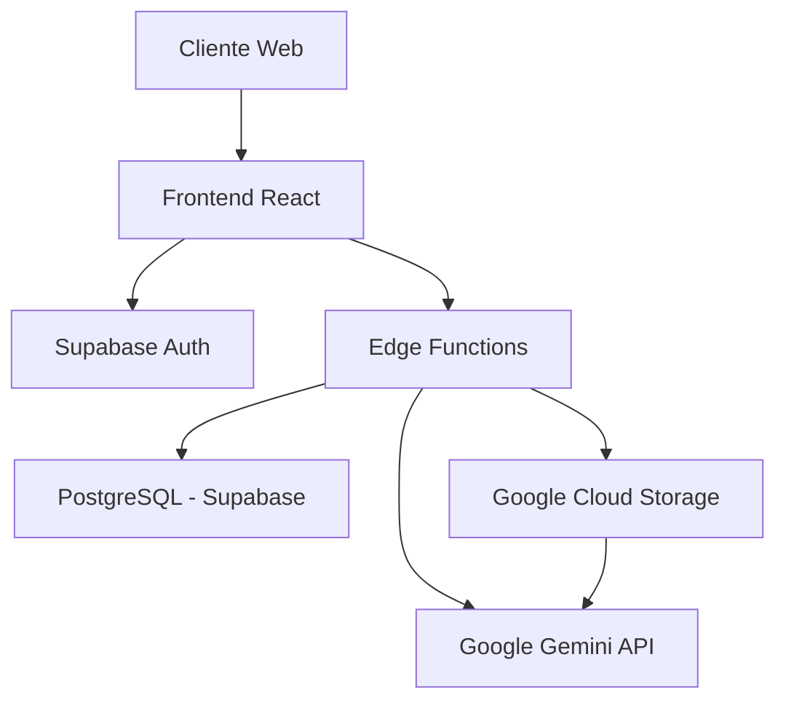
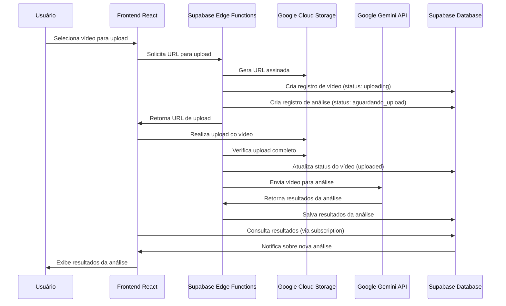
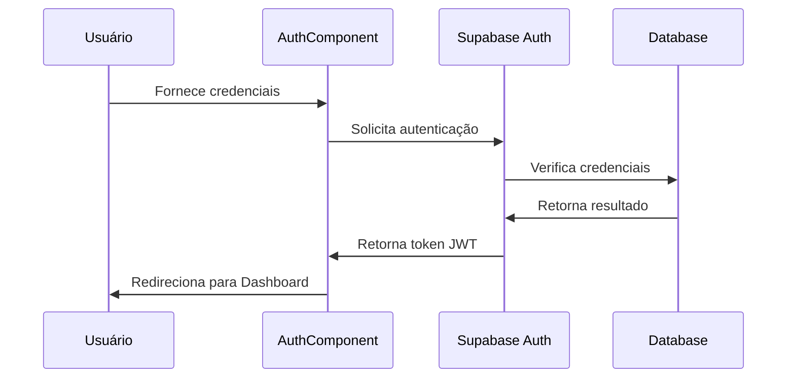

# Padrões de Sistema do LaciaVisionLLM

## Arquitetura Geral
O LaciaVisionLLM segue uma arquitetura baseada em:
- Frontend React com Vite e TypeScript
- Backend serverless com Supabase (PostgreSQL + Edge Functions)
- Armazenamento de vídeos no Google Cloud Storage (GCS)
- Integração com API Gemini para análise multimodal
- Sistema de autenticação e autorização via Supabase Auth

## Padrões de Design
1. **Component-Based Architecture**
   - Componentes pequenos e reutilizáveis
   - Separação clara de responsabilidades
   - Composição para construir interfaces complexas

2. **Custom Hooks Pattern**
   - Lógica de negócio encapsulada em hooks personalizados
   - Separação entre UI e lógica
   - Reutilização de lógica entre componentes

3. **Context API Pattern**
   - Contextos para gerenciamento de estado global
   - AuthContext para gerenciar autenticação
   - Evita prop drilling

4. **Service Layer Pattern**
   - Serviços encapsulados para integração com APIs
   - FileService, GCSService, AnalysisService
   - Isolamento da lógica de comunicação externa

5. **Protected Routes Pattern**
   - Componente ProtectedRoute para segurança
   - Redirecionamento automático para login
   - Verificação de permissões baseada em roles

## Fluxos de Dados Principais

### Fluxo de Upload e Análise de Vídeo

### Fluxo de Autenticação

## Estratégias de Dados
1. **Row Level Security (RLS)**
   - Políticas de segurança no nível do banco de dados
   - Controle de acesso granular baseado em roles e IDs

2. **Realtime Subscriptions**
   - Uso de canais realtime do Supabase
   - Atualizações instantâneas da interface

3. **Optimistic Updates**
   - Atualizações na UI antes da confirmação do servidor
   - Melhora percepção de performance

4. **Lazy Loading**
   - Carregamento sob demanda de componentes pesados
   - Melhora performance inicial
